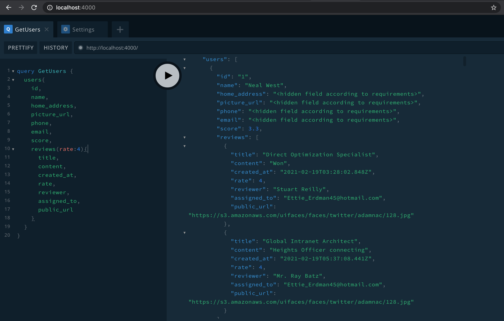
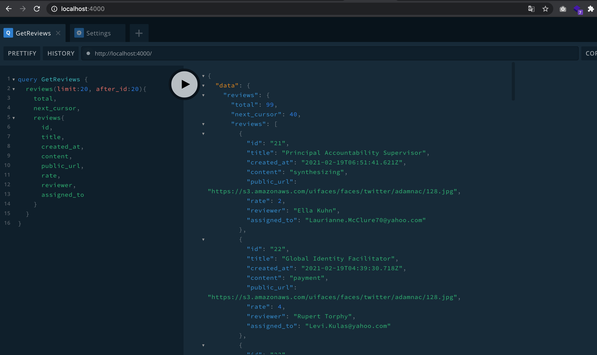

# GraphQL-Reviews

> A Graphql backend that allows to manage users reviews. 🚀

## File structure

The app is split out into two folders:
- `graphql-backend`: The GraphQL backend that run an apollo server 
- `mock-server`: A sample Node REST API that expose two endpoints `/items` and `reviews`, both return data from statics json files inside `db` folder
 
 ## Results
- [x] GraphQL schema
- [x] Typedefs of clients API
- [x] Resolvers written in typescript
- [x] Display users with their average rate (score)
- [x] For each member, display reviews in anti-chronological order
- [x] Allows user to filter review per rate (1,2,3,4,5)
- [x] Members with no review are not included in results
- [x] One year old reviews are ignored from results 
- [x] User personals informations are hidden as required, only the user `id` and `name` are displayed 
- [x] Non assigned reviews are not included in results
- [x] Cursor pagination is done as per required


## Installation

 - Clone the repository
 ```bash
 $ git clone https://github.com/Doha26/graphql-reviews.git
 ```
 
- Start the mock server on the PORT `3000`:

```bash
cd graphql-reviews/mock-server && yarn && yarn start
```

- Start the GraphQL server :
```bash
cd graphql-reviews/graphql-backend && yarn
```

- Create .env file at the root of  `graphql-backend` folder and add the followings values
 ```bash
BASE_API_URL =  'http://localhost:3000/'
PORT=4000
APOLLO_INTROSPECTION=true
APOLLO_PLAYGROUND=true
 ```

- Start the Apollo server. At the root of `graphql-backend` run the command

```bash
yarn start
```

- You will see the output below 
```bash
Server is running!
Litening on port 4000
Explore at https://studio.apollographql.com/dev
 ```
- Go to [http://localhost:4000]() to interact with the Apollo server using GraphiQL  
 
 ## Demo

###  Users #1


###  Reviews #2

